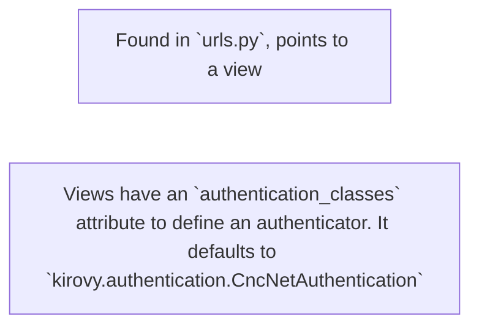

# Authentication and Permissions
---

How permission is determined:

1. UI requests a JWT from the CnCNet ladder API
2. The UI calls Kirovy and includes the JWT token
3. The function `kirovy.authentication.CncNetAuthentication.authenticate` is called, which will create or updates
   the user object in Kirovy, then set `request.user` to that object.
4. The permission classes check their various permissions based on `request.user`

